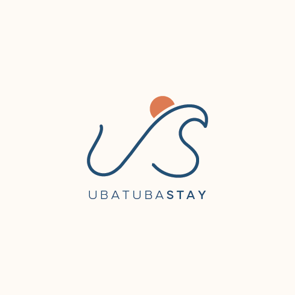

# Ubatuba Stay

<p align="center">
  
</p>

<p align="center">
  
</p>

> **Projeto em desenvolvimento.** Esta landing page continua em evolução visual, técnica e de conteúdo.

## Sobre o projeto

A Ubatuba Stay é uma marca pessoal criada para apresentar uma forma cuidadosa e contemporânea de gerir imóveis por temporada e co-hosting em Ubatuba, SP. O projeto transforma essa proposta em uma experiência digital acolhedora, clara e centrada na confiança.

O site foi produzido inteiramente com **vibe coding**: uma construção guiada por direção criativa, iteração rápida, experimentação visual e colaboração com ferramentas de inteligência artificial.

## Identidade visual

O logo nasce do encontro entre três referências: a espontaneidade de um traço **hand-drawn**, a exploração assistida por **IA** e o refinamento manual de vetores no **Adobe Illustrator**. A linha orgânica remete ao movimento das ondas e ao contorno da costa; o círculo coral sugere o sol e traz um ponto de calor à paleta.

O resultado busca equilibrar a imperfeição expressiva do desenho manual com uma composição limpa e sofisticada, alinhada ao território, ao mar e à hospitalidade da marca.

## Tecnologias

- React 18
- Vite
- JavaScript
- Tailwind CSS
- GSAP e ScrollTrigger
- Lucide React
- CSS custom properties para os tokens do design system

## Processo de desenvolvimento

O trabalho foi organizado nesta sequência para manter a exploração criativa conectada a decisões de produto e implementação:

1. **Mockup inicial no Figma**: definição de uma estrutura básica, hierarquia de conteúdo e primeiras referências visuais.
2. **Escolha da stack**: definição das tecnologias adequadas para uma landing page rápida, responsiva e com bom controle de animações.
3. **Design system com IA**: geração e refinamento de tokens, componentes e diretrizes visuais com apoio de ferramentas de inteligência artificial.
4. **Primeiro mockup funcional**: tradução do direcionamento visual para uma interface real em React.
5. **Revisão de UI e UX**: evolução da experiência por meio de prompts e programação manual, com adição de efeitos dinâmicos, ajustes de interação e melhorias de navegação.

## Como executar

```bash
npm install
npm run dev
```

Para gerar a versão de produção:

```bash
npm run build
npm run preview
```

## Estrutura principal

```text
src/
  assets/        # fontes, imagens e logo
  components/    # elementos de interface e seções da página
  config/        # configurações de contato
  data/          # conteúdos estruturados da landing page
  hooks/         # hooks de navegação e animação
  utils/         # utilitários compartilhados
```
